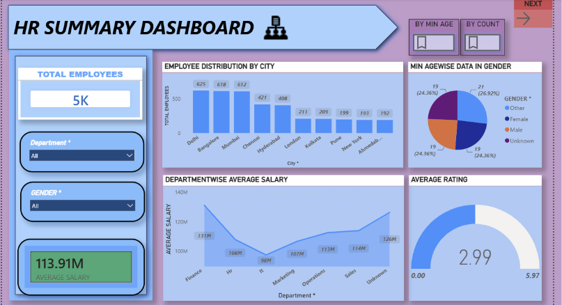
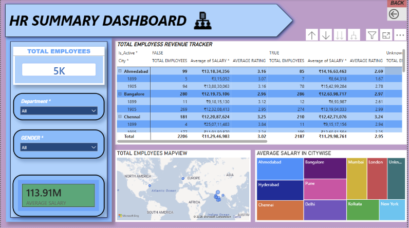

# HR-DATA-ANALYSIS-AND-DASHBOARD
This Repository Contains Various HR Datasets and cleaning , transforming the data in Excel, followed by building an interactive Power BI dashboard to analyze employee demographics, attrition, and workforce trends, demonstrating a complete beginner-friendly data analytics workflow. This mini project was created to learn and practice **Microsoft Excel** and **Power BI** by working with a real-world HR dataset sourced from **Kaggle**. It helps organizations analyze employee attrition, workforce demographics, salary distribution, and key HR metrics to support data-driven decision-making.
---

## 🚀 Features

- Data cleaning and preprocessing
- Interactive Power BI dashboard
- Employee attrition analysis
- Department-wise performance insights
- Gender and age distribution analysis
- KPI tracking and visualization

---

## 🛠️ Technologies Used

- Power BI
- Microsoft Excel
- Power Query
- DAX
- Data Visualization

---

## 📂 Project Structure

```
Project/
│
├── Data/
│   ├── Raw_Data.xlsx
│   └── Cleaned_Data.xlsx
│
├── Dashboard/
│   └── HR_Analytics.pbix
│
├── Images/
│   ├── dashboard.png
│   └── charts.png
│
└── README.md
```

---

## 📊 Dashboard Preview


---

## 📈 Key Insights

- Overall employee attrition rate
- Average employee age
- Salary distribution
- Department-wise attrition
- Job role analysis
- Gender diversity

---

## ▶️ Usage

- Open the Power BI report.
- Interact with slicers and filters.
- Explore different HR KPIs and insights.

---

## 📁 Dataset

Source:
- Company HR dataset (Kaggle.com)

Columns include:
- Employee ID
- First Name
- Last Name
- Date Of Birth
- Age
- Gender
- City
- Mail
- Phone
- Department
- Salary
- Joining Date
- Performance Rating
- Is Active

---

## 📌 Future Improvements

- Add predictive attrition analysis
- Connect to SQL database
- Publish dashboard to Power BI Service
- Add real-time data refresh

---

## 🤝 Contributing

Contributions are welcome.

1. Fork the repository
2. Create a feature branch
3. Commit your changes
4. Push your branch
5. Open a Pull Request

---

## 📄 License

This project is licensed under the MIT License.

---

## 👤 Author

**INDRAJITH P M**

LinkedIn: www.linkedin.com/in/indrajith-p-m-a47a78218
